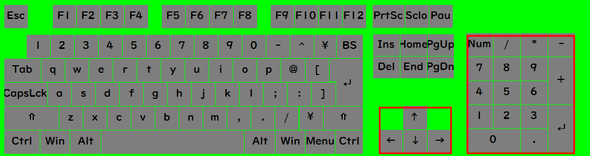
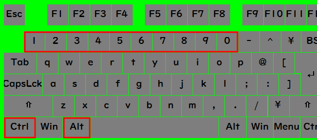
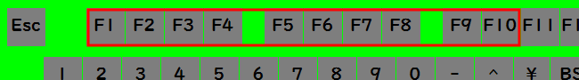

# キーボード強調画像のプレビュー

## 1. テンキー・矢印キー（移動とカメラ操作）
FF11のキーボード操作で使用する「テンキー」と「矢印キー」の部分を赤枠で囲んだ画像です。

* **保存先**: [keyboard_layout_highlighted_fixed.png](./画像素材/images/keyboard_layout_highlighted_fixed.png)

---

## 2. メインキーボード（マクロ操作・Ctrl・Alt・数字キー）
マクロの実行やパレット切り替えで使用する「Ctrl」「Alt」「1〜0」のキーを赤枠で囲んだ画像です。

* **保存先**: [keyboard_layout_left_highlighted.png](./画像素材/images/keyboard_layout_left_highlighted.png)

---

## 3. ファンクションキー（ターゲット操作）
ターゲット選択で使用する「F1〜F10」のキーを赤枠で囲んだ画像です。

* **保存先**: [keyboard_layout_function_highlighted.png](./画像素材/images/keyboard_layout_function_highlighted.png)
